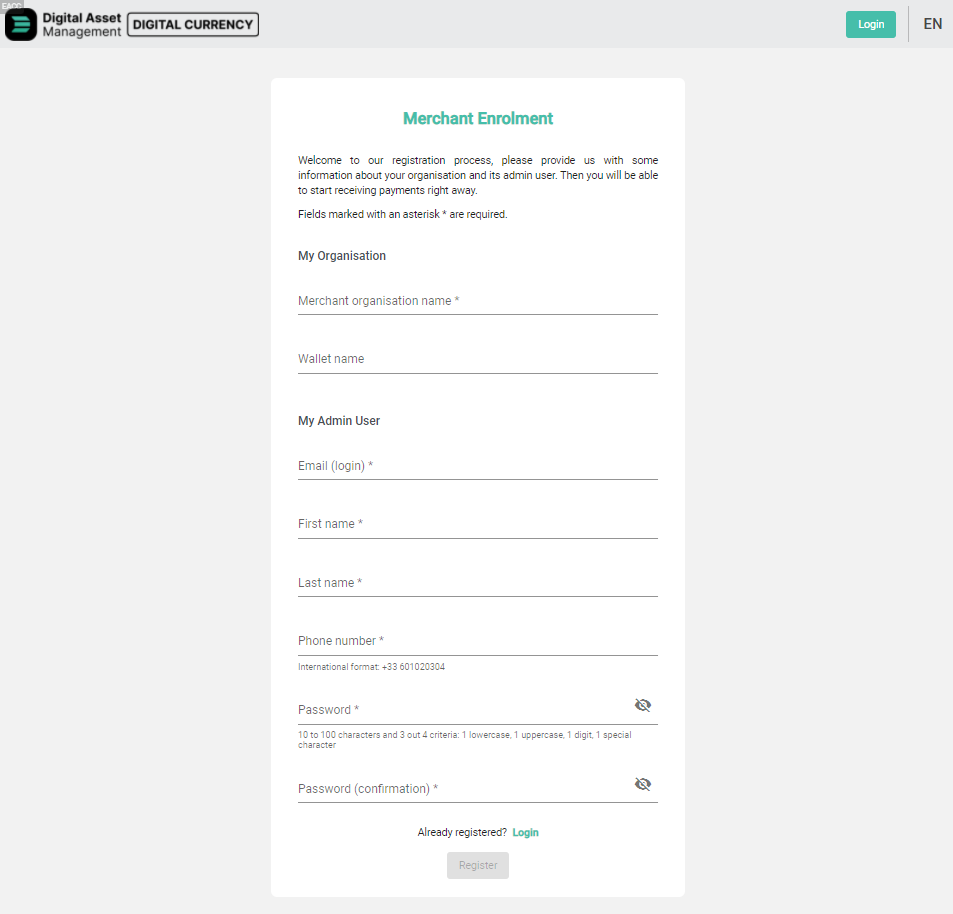
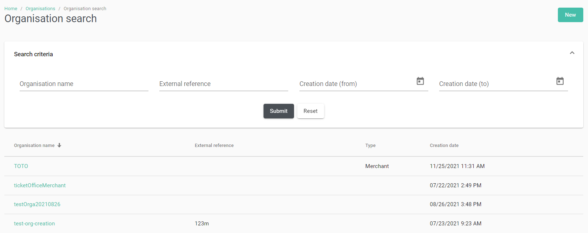
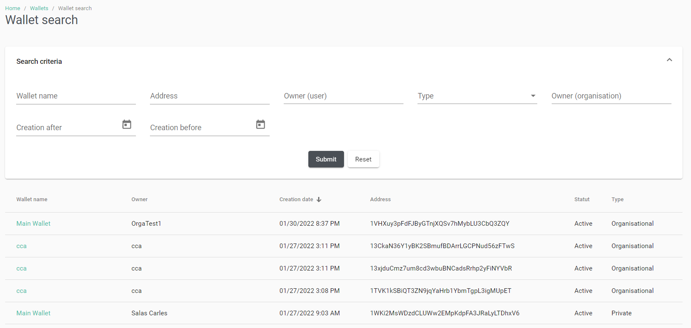
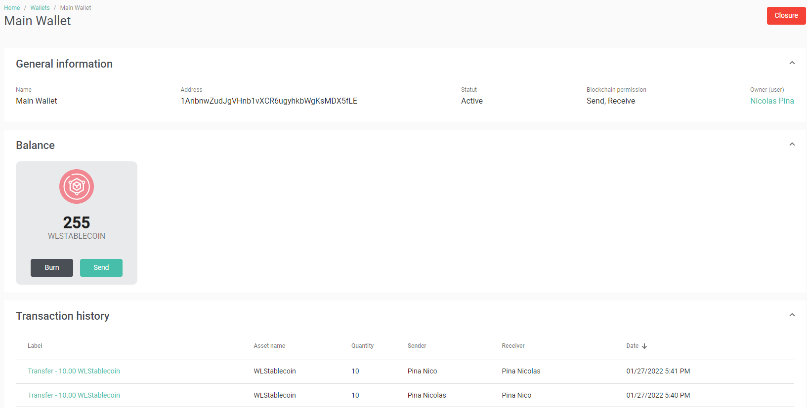
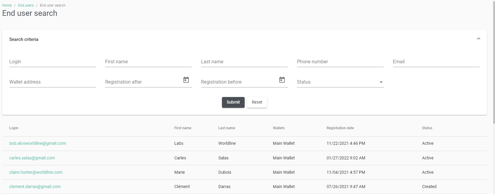

# Back Office
The DAM Platform Back Office is accessible only to the administrators (Issuer and acceptance network). 
The main functionalities available to each player are described in this document. It is possible to customise the design of the web site with the logos of the Issuer. 

## Login
To access the Back Office, the users must use their credentials: 
* Connexion ID: email address. 
* Password: See the password management rules 
Once the users are logged in successfully, they are automatically redirected to the dashboard page.

<figure>

<figcaption align="center"><b>Login page</b></figcaption>
</figure>

## My Profile
The users can access their profile page by clicking on the link “My Profile” in the menu on the right of the top 
toolbar. 
The users can consult the following general information:
* Login: the email is used as the unique reference of the user
* First name
* Last name
* Email: must be unique
* Phone number
* Organisation
* Profile 
They can also edit their own password by entering twice the new value which must match the password 
management rules.

<figure>

<figcaption align="center"><b>User profile page</b></figcaption>
</figure>

## Acceptance Network Enrolment
The acceptance network can have their user accounts, organisations and wallets created by the Issuer : 
* The Issuer can create the organisations, the wallets and the admin user account needed for the 
merchant. 
* The account credentials will be sent to the admin user at the end of the process. 

<figure>

<figcaption align="center"><b>Merchant enrolment page</b></figcaption>
</figure>

## Dashboard
After a successful login, the back-office users are automatically redirected to their dashboard. 
The information displayed varies according to the user’s profile. 

### Issuer <!-- do not modify this line -->
4 parts are available: 
* Merchant Overview: number of merchants on the platform 
* End-User Overview: 
    * Number of sign-ups: 
        * Total number of sign-ups 
        * Number of sign-ups in the last 24h 
        * Number of sign-ups of the day before (between the last 24h and the last 48h) 
    * Number of active end-users: 
        * Total number of active end-users 
        * Number of account activations in the last 24h 
        * Number of account activations of the day before (between the last 24h and the last 48h) 
    * Number of account deletions: 
        * Total number of account deletions 
        * Number of account deletions in the last 24h 
        * Number of account deletions of the day before (between the last 24h and the last 48h) 
* Asset Overview: 
    * Total number of transactions 
    * Number of transactions of the last 24h 
        * Total number of transactions of the last 24h 
        * Difference in transaction number compared to the day before (between the last 24h and the last 48h) 
    * Transaction volume per assets type chart
    * Transaction total amount per assets type chart
* Statistics per asset type: 
    * Total issued tokens per assets chart
    * Total transactions per assets chart
    * Details block for each asset type: 
        * Asset logo and name 
            * Total number of issued asset 
            * Total number of transactions for the asset 
            * Total quantity of the asset 
            * Average amount of transactions in the last 24h 
                * Total average amount of transactions in the last 24h for the asset 
                * Difference in transaction total average amount compared to the day before (between the last 24h and the last 48h) 

<figure>

<figcaption align="center"><b>Issuer dashboard</b></figcaption>
</figure>

### Acceptance network <!-- do not modify this line -->
3 parts are available per wallets:
* Global stats:
    * Total number of transactions
    * Total Balance of the wallet
* Received transactions stats: 
    * Total number of received transactions for the asset 
    * Total received quantity for the asset 
    * Average amount of received transactions in the last 24h 
        * Total average amount of transactions in the last 24h for the asset 
        * Difference in transaction total average amount compared to the day before (between the last 24h and the last 48h)
    * Chart with the number of received transactions and the asset amount of received transactions
* Sent transactions stats: 
    * Total number of sent transactions for the asset 
    * Total sent quantity for the asset  
    * Average amount of sent transactions in the last 24h 
        * Total average amount of transactions in the last 24h for the asset 
        * Difference in transaction total average amount compared to the day before (between the last 24h and the last 48h). 

<figure>

<figcaption align="center"><b>Acceptance network dashboard</b></figcaption>
</figure>

## Assets Management
Assets can be managed by the Issuer administrator. He or she can do the following actions:
* Asset creation
* Asset modification
* Asset issuing 

<figure>

<figcaption align="center"><b>Asset management page</b></figcaption>
</figure>

### Assets Creation
The Issuer can create assets by providing the following information: 
* Asset name: name of the asset to create 
* Reissuable: Boolean to define if the asset can be reissued (manually or automatically once the initial quantity has been consumed (sold, burnt)). 
* Quantity: quantity of assets to issue at the creation 
* Fraction: to define if the asset has decimals 
* Issuing wallet: blockchain address of the wallet which will issue the asset 
* Beneficiary wallet: blockchain address of the wallet which will receive the assets issued at the asset creation 
* Maximum end-user wallet balance: maximum quantity of the created asset allowed on an enduser’s wallet 
* Asset expiration : boolean
* Expiration period : number of days before expiration after issuance
* Transaction limit : boolean
* Transaction count : max number of transactions to consume the assets after issuance
* Asset code: code of the asset 
* Asset label: commercial label of the asset that will be used by the mobile application 
* Asset image: commercial image of the asset that will be used by the mobile application and the back-office to represent graphically the asset

<figure>

<figcaption align="center"><b>Asset creation page</b></figcaption>
</figure>

### Assets Modification
The Issuer can modify several parameters of the asset:
* Asset code
* Asset label
* Maximum end-user wallet balance
* Asset logo 

<figure>

<figcaption align="center"><b>Asset modification page</b></figcaption>
</figure>

### Assets Issuing
An Administrator can issue additional assets if the asset reissuable property (defined at the creation) allows it. 
This process can be automated. 

<figure>

<figcaption align="center"><b>Asset issuing page</b></figcaption>
</figure>

## Assets rates management

### Exchange rate
The Issuer can manage the exchange rates of each assets.

These exchange rates can be provided by two differents ways :
* A specific API provided by the Issuer, integrated in the solution as a specific development.
* Using the DAM API or the DAM back-office to set the values for each currency managed by the platform.

The rules of the exchange rate management are :
* An asset can have only one rate defined.
* A currency code can be used only one time per asset. The backend will control if the currency code exist or not.
* The rate is a numeric and must be > 0.

The possible actions are :
* Adding a rate configuration for an asset.
* Modification of an existing asset rate.
* Deleting an asset rate.

## Loyalty Programs
The product allows the Issuer to manage loyaty programs. 
While a program is active, payment transactions performed with its trigger assets will automatically credit the customer with the reward asset. 

<figure>

</figure>

The credited amount of reward asset is a percentage of the trigger asset transaction amount and cannot exceed the parameterised maximum amount. The percentage and maximum amount are parameters specific to each loyalty program. 
The loyaty programs are active for a period defined by the Issuer at the program creation. 

<figure>

<figcaption align="center"><b>Loyalty program management page</b></figcaption>
</figure>

### Loyalty Program Creation
A loyalty program requires the prior creation of the assets that will serve as reward and / or triggers. 

The Issuer can create a loyalty program by providing the following information: 
* Program (mandatory): name of the loyalty program 
* Asset reward (mandatory): asset that will be credited as loyalty assets 
* Trigger asset(s) (mandatory): list of assets that automatically create the loyalty assets if used in a 
payment transaction 
* Percentage (mandatory): percentage of the transaction amount used to calculate the loyalty asset 
quantity to send to the end user 
* Maximum amount (optionnal): maximal amount that can be calculated and credited to the end user 
* Start date (optionnal): start date of the loyalty program 
* End date (optionnal): end date of the loyalty program 
The same asset can be set as reward and trigger asset. 

<figure>

<figcaption align="center"><b>Loyalty program creation page</b></figcaption>
</figure>

### Loyalty Program Modification
The Issuer can modify several parameter of the loyalty program: 
* Program name (mandatory) 
* Reward asset (mandatory) 
* Trigger asset(s) (mandatory) 
* Percentage (mandatory) 
* Maximum amount (optional) 
* Start date (optional) 
* End date (optional)

<figure>

<figcaption align="center"><b>Loyalty program modification page</b></figcaption>
</figure>

### Loyalty Program Deletion
If the Issuer tries to delete a loyalty program, a confirmation pop-up is displayed asking for confirmation. 

<figure>

<figcaption align="center"><b>Loyalty program deletion page</b></figcaption>
</figure>

## Organisation Management
An administrator can manage organisations (according to their rights). 

<figure>

</figure>

It is possible to: 
* Consult the list of existing organisations 
* Search for a specific organisation 
* Consult organisation details by clicking on a line 
* Create a new organisation. 

<figure>

<figcaption align="center"><b>Organisation search page</b></figcaption>
</figure>

**Search criteria:**
* Organisation name: text field (string) 
* Creation date: range (date) 
    * Date format for display: YYYY/MM/DD HH:MM (according to the selected language) 
* External reference: text field (string) 

**Details:**
<figure>

<figcaption align="center"><b>Organisation details page</b></figcaption>
</figure>

**Creation:**
<figure>

<figcaption align="center"><b>Organisation creation page</b></figcaption>
</figure>

The information needed for an organisation creation: 
* Organisation name: text field (string) - mandatory 
* External reference (for example, the organisation id on the issuer’s external information system): text field (string) - optional 

## Establishments
An administrator can manage establishments (depending on their rights). It is possible to refer to a physical 
establishment to make it easier for end-users to find it on the mobile application. An establishment is attached 
to an organisation.

It is possible to: 
* Consult the list of the establishments of an organisation, 
* Create a new establishment, 
* Delete an existing one 

Establishment List: 
The establishment block contains a result table with the following columns: 
* Name 
* Address: address line (1 & 2), postal code, city, region, country 
* Website 
* GPS coordinates 
* Tag list 

Establishment Creation: 
The administrator must provide the following information when creating an establishment. 
* Title 
* Establishment name : text field (mandatory) 
* Address of the establishement: 
    * Address: 2 text fields (address line 1 and line 2) - line 1 is mandatory 
    * Postal code: text field (mandatory) 
    * City: text field (mandatory) 
    * State: text field (optional) 
* Country: text field (mandatory) 
* GPS coordinates: 
    * latitude: text field (mandatory) 
    * longitude: text field (mandatory) 
* Website: text field (optional) 
* Tags: text field (optional) 

## Wallet Management
An administrator can manage wallets on the platform (depending on their rights). 
It is possible to consult the list of wallets, and to search them. By clicking on a line, the administrator accesses the details of the selected wallet. 

<figure>

<figcaption align="center"><b>Wallet search page</b></figcaption>
</figure>

From the details page, it is possible to close a wallet even if the balance of the wallet is not empty. 
It is also possible to generate the static QR code corresponding to the wallet. The QR code is encrypted to block the scan of its data by another QR code scan application. 
A dynamic QR code can be generated by API to allow the merchant to fill the transaction amount before the QR code generation. 

<figure>

<figcaption align="center"><b>Wallet details page</b></figcaption>
</figure>

## KYC Management
At the instanciation of the platform, the platform owner can define its own KYC rules on the generic DAM KYC engine.
The KYC partner is specific and provided by the Issuer (owner of the platform).
The generic DAM KYC contains :
* KYC engine rules, fully configurable.
* Manual control over asset purchase by the Issuer administrators in case of exceeding of the KYC threehold.

The KYC enrolment and validation is in charge of the KYC partner that will be integrated in the DAM Platform solution.

<figure>

</figure>

### KYC engine description
|Rules Fields|Type|Mandatory|Description|Example|
|------------|----|---------|-----------|-------|
|Level|int|Yes|KYC level of the rule|1|
|Threshold|int|Yes|Maximum amount of the rule|5 000|
|Asset|enum of the assets available|Yes|Asset type of the rule|WLC|
|Currency|currency code|No|Currency of the threshold, if null the threshold is apply in asset|EUR|
|TxTypes|list|No|Transactions type concerned by the rule. If null, all the transactions are concerned)|Payment, P2P transfer|
|TxRuleTypes|enum|Yes|SEND/RECEIVE/BALANCE to define if the rule concerned the transactions in, out, or the balance threshold|SEND|
|Period|int|No|Number of days to calculate the cumulative transactions amount concerned by the rule. If null, the rule is apply on the one-off transaction amount|365|
|Blocking|boolean|Yes|Flag to define if the rule is a blocking one|Yes|
|Alert|boolean|Yes|Flag to define if the rule must trigger an admin alert|Yes|

## Transactions Management
On the product there is different type of transactions: 
* Cash-in: transactions from the Issuer to an end-user (Purchase).
* Bills: transactions from the end-user to the acceptance network (Merchant payment).
* Cash-out: transactions from the acceptance network to the Issuer (Reconciliation). See [Cash-out](#cash-out) dedicated part.

### Cash-in
This type of transactions allows the Issuer to have a view on the ongoing purchase transactions with the endusers. The cash-in transactions are in fiat currency. 
Once the purchase is completed, the Blockchain transaction with assets is made and linked to the cash-in transaction. 
The issuer can search a specific cash-in transaction with the following criteria:
* Cash-in transaction reference 
* End-user wallet address 
* Asset 
* Blockchain transaction id 
* Status: 
    * Created 
    * Cancelled 
    * Refused 
    * Completed 
* Minimum quantity 
* Maximum quantity 
* End-user

<figure>

<figcaption align="center"><b>Cash-in search page</b></figcaption>
</figure>

### Bills
This type of transaction allows the Merchant to have a view on the payment transactions with the end-users. 
The bills transactions are in asset. 

Once the payment is completed, the Blockchain transaction with assets is made and linked to the cash-in 
transaction. 
The user can search a specific payment transaction with the following criteria: 
* Payment transaction reference 
* Merchant wallet address 
* End-user wallet address 
* Asset 
* External reference 
* Blockchain transaction id 
* Status: 
    * Pending 
    * Paid 
    * Cancelled 
* Minimum quantity 
* Maximum quantity 
* End-user

<figure>

<figcaption align="center"><b>Bills search page</b></figcaption>
</figure>

### Blockchain Transactions
Blockchain transactions are all the successful transactions created on the product. 
They cover all types of transactions : 
* Asset creation: assets created at the asset creation 
* Additional issuing: when the Issuer makes an additional issuing of an existing asset 
* Burning: asset destruction from the Blockchain 
* Manual transfer: transfer made by a back-office user to another wallet (Issuer, Merchant, end-user) of the platform 
* Payment: transaction from end-user to Merchant 
* Purchase: transaction from Issuer to end-user 
* Cash-out: transaction from Merchant to Issuer 
* Resell: transaction from end-user to Issuer 
* P2P transfer: transfer between end-users 
* Loyalty reward: transfer from Issuer to end-user 
The user can search a specific Blockchain transaction with the following criteria: 
* Blockchain transaction id  Wallet address  Transaction date (from, to) 
* Asset 
* Type 
* Minimum quantity 
* Maximum quantity 
* Sender 
* Receiver 

<figure>

<figcaption align="center"><b>Blockchain transactions search page</b></figcaption>
</figure>

#### Transactions Details
The user can consult the details of the Blockchain transactions from the transaction search page. 
The general information are: 
* Label of the transaction 
* Sender wallet address 
* Sender name 
* Receiver wallet address 
* Receiver name 
* Transaction identifier 
* Processing date 
* Asset name 
* Type 
* Comment 
* Quantity of asset

<figure>

<figcaption align="center"><b>Blockchain transactions details page</b></figcaption>
</figure>

## Rules on Transactions
The product allows the Issuer to define specifics rules to apply on the transactions. These rules can be manageable on the assets management page.

### Asset expiration :

The admin Issuer have the possibility to define an expiration date for each asset type.

A daily process is executed to check the expiration date of the assets owned by the endusers. When the expiration date is reached, the expired assets are automatically transferred to the issuer's wallet.

At each payment (end-user => merchant) and P2P transfer (end-user => end-user) transactions, the expiration date of the asset is checked to use those closest to the expiration date.

An email notification is sent to the end-user one the assets are expired.

The issuer can override the expiry date by defining the date on which the assets of the transaction it is going to perform for the end-user will expire. This overload is only possible in manual transactions.

### Transactions limit :

When creating an asset, it is possible to define a maximum limit for the consumption of the asset balance purchased by a customer.

At each payment transaction the remaining number to consume the balance is checked and the counter is decremented. When the counter reaches 0, the remaining asset balance is automatically transferred to the issuer's wallet.

An email notification is sent to the customer when the unused assets within the limit are returned to the issuer.

The number of remaining transactions is recorded in Multichain. It is cumulative, so each time an issuer credits an end-user, the number of transactions will be added (+x) and each time an end-user makes a purchase, the number will be deducted (-1) :
* Issuer -> Enduser 1000 coin / 2tx      1000 coin / 2tx.
* Issuer -> Enduser 2000 coin / 3tx      3000 coin / 5tx.
* EndUser -> Merchant 1200 coin        1800 coin / 4tx.

The expiry concerns transactions in the following directions :
* Payments : end-user -> merchant
* P2P transfers : end-user -> end-user
The issuer can override the transaction maximum limit by defining the limit of the transaction it is going to perform for the end-user. This overload is only possible in manual transactions.

## User And EndUser Management

### Users
Administrators can manage users (depending on their rights). 
Via the Users menu, it is possible to: 
* Consult the list of users 
* Search for a user 
* Access the details of a user 
* Create a new user 

#### User Search
<figure>

<figcaption align="center"><b>User search page</b></figcaption>
</figure>

#### User Details
The details of a user are accessible by clicking on his/her login from the list of users. 
From this page an administrator can: 
* Consult the details of the user 
* Edit: 
    * First name 
    * Last name 
    * Email 
    * Phone number 
* Delete a user: 
    * Completely delete the user's account and associated data. 
* Deactivate a user: 
    * The user can no longer log in. However, the account can be reactivated. 
* Reinitialise the user’s password: an email is sent with the procedure to follow to redefine a password. 

<figure>

<figcaption align="center"><b>User details page</b></figcaption>
</figure>

An audit trail is present, tracing the modifications made on the user.

### EndUsers
Administrators can manage end users (depending on their rights). 
Via the end users menu, it is possible to: 
* Consult the list of end-users 
* Search for an end-user 
* Access the details of an end-user 

#### EndUsers Search
Search criteria: 
* Login (text field) (search like) 
* First name (text field) (search like) 
* Last name (text field) (search like) 
* Phone number (text field) (search non-like) 
* Email (text field) (search like) 
* BC address (text field) (search like) 
* Status (list) 
    * Active 
    * Created 
    * Deactivated 
* Creation date (range) 

<figure>

<figcaption align="center"><b>EndUser search page</b></figcaption>
</figure>

By default all the criteria are empty. 

#### EndUsers Details
The details of an end-user are accessible by clicking on an end-user line from the list. 
From this page an administrator can: 
* Consult the end-user’s details 
* Edit: 
    * First name 
    * Last name 
    * Email 
    * Phone number 
* Deactivate a user: 
    * The user can no longer log in. However, the account can be reactivated. When a user account is deactivated, an email is sent to the user to inform them. 
* Reinitialise the user’s password 
    * A mail is sent to the user to allow them to update their password. 

<figure>

<figcaption align="center"><b>EndUser details page</b></figcaption>
</figure>

## Permissions And Rights
The various features are associated with rights. A set of rights is a user profile on the application. 
These rights allow users to be authorised or not to see and use the features. 
See Annex 2 for the default implementation.

Customised profiles can be defined at the platform instanciation according to the Issuer needs.

## Cash-out
The cash-out process is the feature allowing the transfer of all the assets or part of the balance of the merchant wallets to the Issuer wallets, to carry out the reconciliation outside the application.

<figure>

</figure>

### Cash-out From Issuer
The Issuer can launch the cash-out process through his/her dashboard, by clicking on the cash-out process button on the top right of the page. 

<figure>

<figcaption align="center"><b>Manual cash-out trigger by the Issuer</b></figcaption>
</figure>

Once the Issuer has clicked on the cash-out button, a pop-up is displayed describing the process and the Issuer must select the asset(s) he wants to process. 

<figure>

<figcaption align="center"><b>Cash-out process trigger pop-up</b></figcaption>
</figure>

If the Issuer confirms the action : 
* Transactions are created to credit the Issuing wallet with the selected asset(s) from the Merchant’s wallets. 
* A cash-out file is created to allow the Issuer to make the payments to the Merchants with fiat currencies outside the product. 
* Emails are sent to the different parties : 
    * Issuer : Email with the link to download the cash-out file generated 
    * Merchants : Email with the list of the transactions from its wallets 

Cash-out emails are sent to the Issuer who launched the process and to the Issuers and Merchants who are 
subscribed to the cash-out notification (manageable on their user profile).

### Cash-out From Merchant
The Merchants can make cash-out requests from their wallets. 
On the wallet details page, the cash-out process can be requested for each assets individually. 
For the assets with a balance > 0, the cash-out button is available. 

<figure>

<figcaption align="center"><b>Manual cash-out trigger by the Merchant</b></figcaption>
</figure>

If the Merchant clicks on the cash-out button for one asset, a pop-up is displayed to the user with a description 
of the process, asking the Merchant to indicate the quantity of asset to cash-out. 

<figure>

<figcaption align="center"><b>Cash-out request pop-up</b></figcaption>
</figure>

If the Merchant confirms the action, a cash-out request is created in a “waiting validation” status with the filled amount for the corresponding asset. An email is sent to inform the issuer that a cash-out process request was created. 
This request must be validated by the Issuer.

### Cash-out Request Validation
The Issuer can validate the cash-out request of the Merchants on the cash-out search page (Transaction > Cash-out).

The Issuer can search a specific request with the following search criteria: 
* Reference of the request 
* Request date (from, to) 
* Organisation name 
* Organisation wallet address 
* Asset Blockchain identifier 
* Request status : 
    * Waiting validation 
    * Finalised 
    * Rejected 
* Minimum quantity 
* Maximum quantity 

<figure>

<figcaption align="center"><b>Cash-out request search page</b></figcaption>
</figure>

To accept a pending cash-out request, the Issuer must click on the validation button, a pop-up is displayed to confirm the action. 

<figure>

<figcaption align="center"><b>Cash-out request validation pop-up</b></figcaption>
</figure>

After validation, a blockchain transaction from the Merchant wallet to the Issuer wallet is created, and the cash-out process file is generated. Confirmation emails are sent to the Merchant and the Issuer. 
The cash-out request is set to the finalised status. 

### Cash-out Request Rejection
To reject a pending cash-out request, the Issuer must click on the rejection button, a pop-up is displayed to confirm the action.

<figure>

<figcaption align="center"><b>Cash-out request rejection pop-up</b></figcaption>
</figure>

After rejection, no blockchain transaction is created, and no cash-out process file is generated. Rejection emails are sent to the Merchant and the Issuer. 
The cash-out request is set to the rejected status.

### Cash-out Files
 The Issuer can search and download a specific request with the following search criteria: 
 * File name 
 * User who has launched the process 
 * Generation date (from, to) 
 * Assets 

<figure>

<figcaption align="center"><b>Cash-out files search page</b></figcaption>
</figure>

The content of the file is: 
* Merchant organisation name 
* Asset 
* Amount 

The Issuer will use these files to apply its commission rate and make the settlement in fiat currency to the 
Merchants 

## Audit Trail
The modifications made by the administrators in the back office are traced in the audit trail. An event stored in 
the audit trail contains the following elements : 
* Event date and time 
* The user performing the action, or the system in case of an automatic action 
* Type of event 
* Specific details linked to the event 

## Instance Administration

### Graphical Elements
Administrators can manage and customise the following logos of the back-office : 
* Short logo : png and svg 
* Long logo : png and svg 
* Email logo : png 
The current logos are displayed 
The maximum size allowed is 100ko 

<figure>

<figcaption align="center"><b>Back-office logo customisation</b></figcaption>
</figure>

Administrators can manage and customise the "marketing" cards displayed on the mobile application: 
The possible actions are: 
* Adding a new card 
* Editing a card 
* Removing a card 
The maximum number of cards is 3. If the number of cards is > 3, the creation button is disabled. 

<figure>

<figcaption align="center"><b>Mobile cards customisation</b></figcaption>
</figure>
