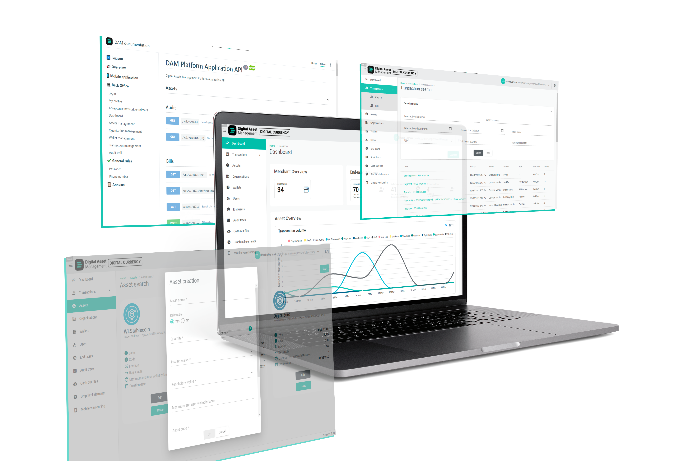

# Overview

## Introduction

The world is going digital since many years, but decades old technologies are still in use and some are becoming complex, slow and expensive to manage and maintain.

A newly used in production technology, <b>Blockchain</b>, is offering new opportunities for business to operate secured and distributed ecosystems; enabling <b>frictionless, programable</b> and <b>trustable</b> digital native payment experiences. 

Today, we are seeing this technology reinventing money with <u>digital currencies</u> empowering <u>Retail</u> and <u>Banking</u> usecase for <b>better efficiency</b> and <b>less operating cost</b>. However this technology has much more unexplored potential. Indeed, it enable the <b>seamless digitization of any real world assets</b> allowing business to trace and trade digital version of <u>stocks</u>, <u>vouchers</u>, <u>gifts cards</u>, <u>tickets</u> and <u>loyalty point</u>. All on one unique platform. 

<u>Multinational retailers</u> and <u>trade associations</u> are able to <b>streamline business processes</b> by incorporating their own business rules inside this shared ecosystem. For the first time in history, we are seeing business partnering with each other with simplicity in other words : <b>Reinventing Trust</b>. They achieve this using Distributed Ledger Technology removing the need of giving complete market power to one central authority. Indeed, now competing banks are partnering with each other thanks to this solution allowing them to don't just trust by verify with simplicity.

The same apply to the local economy we are seeing <u>governments</u> working with local businesses to stimulate the local economy and create much more then payment in theses new digital payment ecosystems. 

## Meet the DAM Platform

### Our Goal

We are building a future where value is transferred as easily and efficiently as information. Where what we call payment will also integrate any products that can be transformed into digital assets.

To do so we are focus on creating an <b>innovative, modular</b> and <b>future proof</b> platform; WL Digital Asset Management to be a key building block of <b>the future of PayTech</b>.

<figure>

</figure>

### An End-to-End Platform

One unique platform that digitalizes the entire value chain for Value Explosion. Our goal with this approach is to have different building blocks that will cover different clients needs regarding the type of implementation they want to use. 

<figure>

</figure>

### 1. Create a secured operation network

DAM is a blockchain based solution, we implement a private blockchain for you and your trusted partners so you can manage digital assets transactions. 

#### DAM blockchain network
This operation network is secured by design and offer key business benefits like :

<b>Accurate tracking</b>,  all transaction are timestamped and recorded on the blockchain. For each transaction we can ensure that only the owner of the wallet did the transaction and we can trace back all the transactions done by this user. 

<b>Permanent data storage</b>, the DAM network is designed such that no one can change the blockchain, once the transaction blocks get added on the chain, no one can go back and change it. Thus, any user on the network won’t be able to edit, delete or update it past transactions. 

<b>Instantaneous Settlement</b>, on DAM because of the blockchain technology that we use, transactions are instantaneous and directly written on the blockchain. The settlement is done automatically ensuring that it's the right user that do a transaction, that he has what we want to send and the rights to do so. Also by design we ensure that there is no double spending that can happen on the platform. Since the network do this settlement for you you can ensure fast settlement time on your application with a high level of security. 

<b>Verifiable and Trustable</b>, using your own <u>private blockchain network</u> you will be able to create an ecosystem with your partners where you don't need to trust a third party but a system where at any point you can verify that nobody is cheating on the network. Reinventing trust between multiple parties. 

#### Issuance of digital assets
Using blockchain technology you can tokenize any type of real life assets. Using DAM you will have a solution allowing the digitization of multiple assets such as cash, ticketing, loyalty, vouchers; all in one modular end-to-end solution.

On DAM you will issue a digital asset when you want to represent something real in a digital way or create a purely digital element. Then regarding how fungible the asset is you can issue one of the following type. 

<figure>

</figure>

<b>Fungible Assets</b>

"<em>These are assets that can be interchanged with other individual goods or assets of the same type.</em>"

Using this type of asset on DAM enable physical assets like cash or gold to be digitized and represented on the blockchain as a digital currency. But can also be used issue loyalty points, digital gifts cards or even take some stock option and make them more liquid using blockchain tokenization. 

<b>Non-Fungible Assets</b>

"<em>Assets that can not be interchanged with other of the same type. They're unique and special.</em>"

Using this type of asset on DAM enable physical assets like fine art or real estate to be digitized and represented on the blockchain as digital asset called NFT. But can also be used issue digital tickets or represent digital title of ownership. 

### 2. Streamline business processes
#### Business logic
Over digital payment ecosystem, programmability is key. On the product by design we offer many business rules to streamline your business processes. 

We can integrate rules over transaction encompassing KYC verification and balance cap while the user are not totally registered. We can whitelist and blacklist some merchant on some token types, and even automatize loyalty schemes and cashback systems. Allowing DAM to do much more then just payment, and powering your next services for any ecosystems.

#### Connector
DAM in integrated with many WL product and can also be connected to your external providers for KYC, Payment Gateway and more services.. Enabling you to connect your day to day process to this private blockchain platform. 

#### Monitoring
DAM BO, is an included Web Application tool that allows our customers to have a transparent monitoring experience of all blockchain transactions, search features and audit trails. Making monitoring for you and your partners simple in the future it will even include custom dashboard and reporting tools. 

<figure>

</figure>

### 3. Empower frictionless customer experience 

With DAM you make blockchain simple and accessible for everyone. And with have the rights tools for developers, merchant and end user to accelerate adoption and reduce time to market. 

#### API
You can integrate the product directly inside existing application using our APIs and our developer friendly documentation tools. 

#### Whitelabel Mobile
We also provide mobile wallets that can be customized with your branding, enabling <u>merchant</u> and <u>end users</u> to adopt digital currency and digital asset in their day to day life in no time. 

Using DAM you will really create a mobile first digital payment experience with great user experience for all your customers. 

<figure>

</figure>

### Structure of the solution

<figure>

</figure>

### Usecases

We’ve provided some <u>Case Studies</u> that help explain the different uses of the DAM Platform.

## Features and Benefits 
* Create and distribute you own blockchain network between you and selected partners. 
* Onboard users and business with the right level of KYC and KYB needed directly integrating your partner's APIs.
* Configure User's and Business wallets capabilities with rules on transaction and ownership of digital assets. 
* Simplify the registration of a new asset type with DAM BO for integration into DAM MA and other supporting applications.
* Configure and issue digital asset on the go with DAM BO.
* Distribute digital asset to registered users and business.
* Coordinate the Purchase and ReSell of digital assets with DAM BO. 
* Apply amount based transfer restrictions to registered users.
* Monitor users, wallet balances, transactions activities with DAM BO with dedicated search feature and dashboards.
* Track reissuance and burn of an asset’s circulating supply. (CAN WE, with audit trail ?)
* Automatize the calculation and distribution of cashback and loyalty points ass digital assets directly with DAM BO.
* Trace platform activity directly with DAM BO Audit Trail feature. 